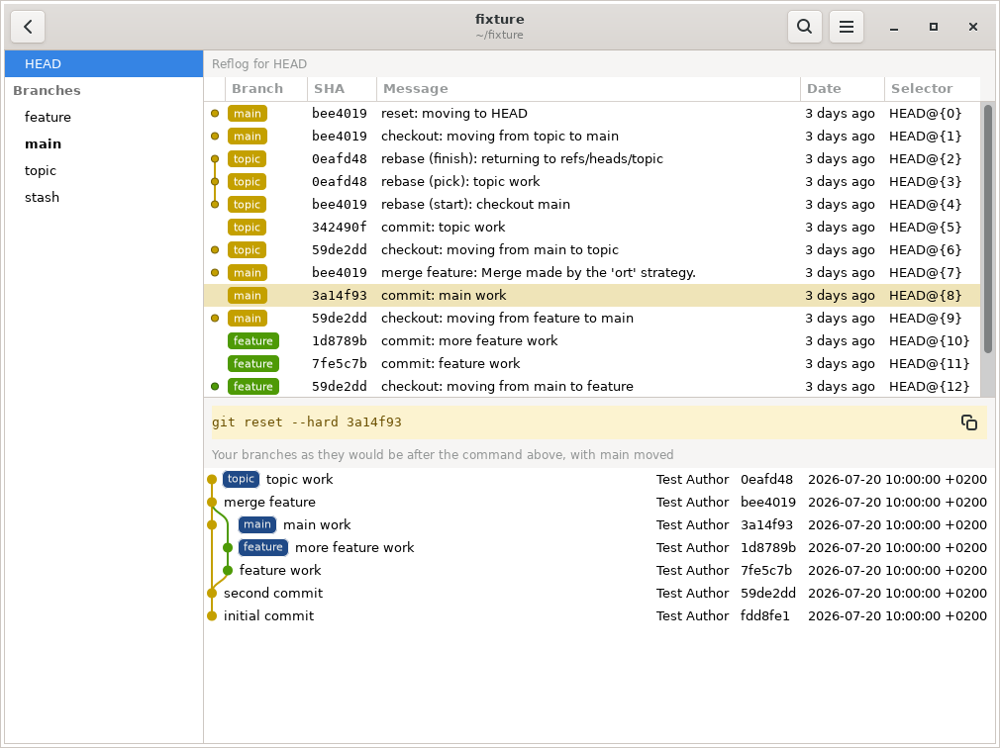

# `gitrl-z`

> A tool to help you undo the predicament you found yourself in in `git`

`gitrl-z` shows the reflog the way `gitg` shows history, and previews what a `git reset --hard` would do before you run it. It's pronounced git-ROL-ZED (/ɡɪtˈrəʊlzɛd/), after ctrl-z said aloud: control zed.

The reflog remembers where every branch has been, including commits that a rebase rewrote or a reset abandoned. `gitrl-z` lists it, and when you click an entry it shows your whole history with that entry's branch label moved to where a reset would put it, so you can see where the branch would land without losing sight of what it would leave behind. **Nothing is ever written to the repository.**



It is built from `gitg`: written in gitg's own language (Vala), against the same libraries, and the commit graph in the preview is gitg's own renderer.

## Examples

Each of these is a moment where `git` has left you stuck, and `gitrl-z` shows the way out without writing anything to the repository.

- **You ran `git reset --hard` and your commits vanished.** Find the reflog entry from just before the reset and click it. The graph redraws with your branch moved back to where it was, so you see exactly what returns, and `gitrl-z` shows you the `git reset --hard` command that brings it back.
- **A rebase left the branch in a mess.** The reflog still holds the tip from before the rebase. Click it to see the branch back at that commit, in the same graph as the rebased version, and reset only once it looks right.
- **You deleted a branch and want it back.** `gitrl-z` finds where the branch last pointed and offers to recreate it there, so `git branch -D` need not be the end of it.
- **You landed in a detached HEAD and are not sure how.** It shows where HEAD is sitting among the branches and offers to reattach.
- **You are about to reset and want to be sure.** Point it at any reflog entry and it draws the resulting history first, so "where will this land?" stops being a guess.

## Installing

### From Launchpad

From the PPA ([available for Ubuntu 24.04 and 26.04](https://launchpad.net/~li9i/+archive/ubuntu/gitrl-z)):

```bash
sudo add-apt-repository ppa:li9i/gitrl-z
sudo apt-get install gitrl-z
```

The package is `gitrl-z`; the command is `gitrlz`.

### AppImage

Download the AppImage from the [releases page](https://github.com/li9i/gitrl-z/releases): it's a single file that needs no install. Make it executable and run it:

```bash
chmod +x gitrl-z-*-x86_64.AppImage
./gitrl-z-*-x86_64.AppImage
```

If your machine has no FUSE, run it unpacked instead, which needs nothing extra:

```bash
./gitrl-z-*-x86_64.AppImage --appimage-extract-and-run
```

To call it as `gitrlz` from any directory, add an alias to your shell from the folder holding the AppImage, then reopen the terminal:

```bash
echo "alias gitrlz='$PWD/gitrl-z-*-x86_64.AppImage'" >> ~/.bashrc
```

## Building from source

```bash
git clone https://github.com/li9i/gitrl-z.git
cd gitrl-z
```

The AppImage, portable and running on most distributions:

```bash
./scripts/build-appimage.sh
# -> gitrl-z-<version>-x86_64.AppImage in the repository root
```

A `.deb`, built inside a container that matches the target Ubuntu so it links that release's libraries (you need Docker):

```bash
# Ubuntu 24.04
docker build -t gitrlz-build .
docker run --rm --user "$(id -u):$(id -g)" -e HOME=/tmp \
    -v "$PWD:/src" -w /src gitrlz-build ./docker/build-deb.sh

# Ubuntu 26.04
docker build --build-arg UBUNTU=26.04 -t gitrlz-build:26.04 .
docker run --rm --user "$(id -u):$(id -g)" -e HOME=/tmp \
    -v "$PWD:/src" -w /src gitrlz-build:26.04 ./docker/build-deb.sh resolute '~ubuntu26.04.1'
```

The `.deb` lands in `_build/deb/`. Install it with `apt` so its dependencies come with it:

```bash
sudo apt-get install ./_build/deb/gitrl-z_*_amd64.deb
```

## Running

```bash
# cd to a repo ...
gitrlz
```

```bash
# ... or provide the repo as an argument
gitrlz /path/to/repo
```

Run outside a repository, `gitrlz` opens a chooser listing recently used ones.

`F5` reloads. `Ctrl+Q` quits. The window follows the repository as it changes, so a commit or rebase in another terminal shows up without you touching anything.

## Licence

GPL-2.0-or-later, inherited from gitg. See `COPYING`, and `debian/copyright` for the per-file breakdown crediting the gitg authors.
