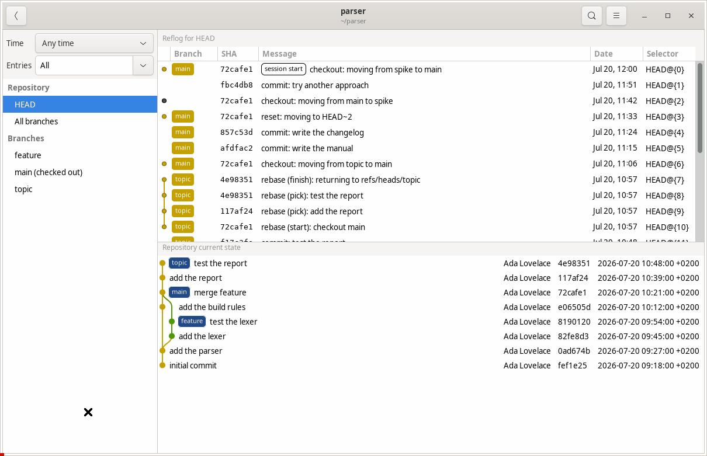
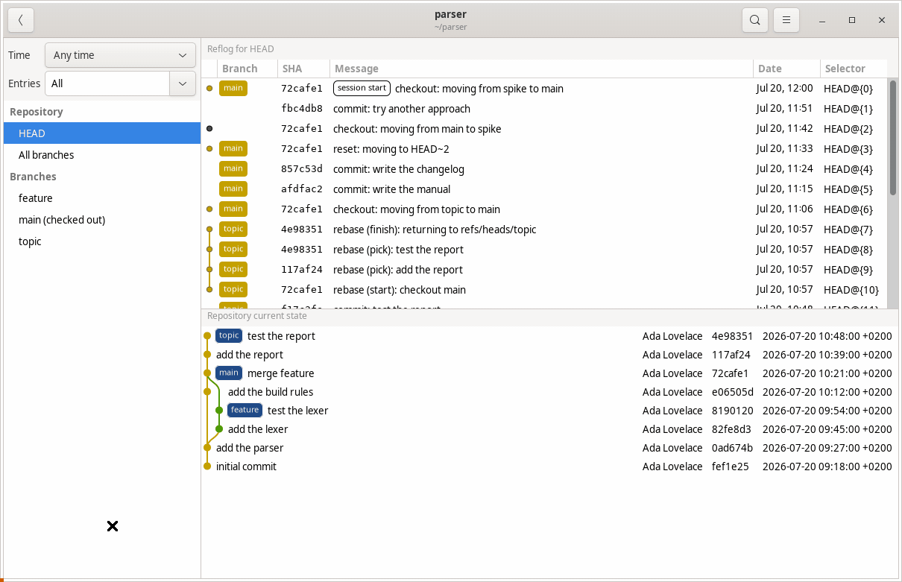

# `gitrl-z`

> A visual reflog browser with reset preview

The reflog records every position of every branch: commits a rebase rewrote, commits a reset abandoned, branches that were deleted. While `git` shows this as a wall of text, `gitrl-z` draws it out.

It lists the reflog the way `gitg` shows history. Click an entry and the commit graph redraws with that branch moved to where a reset would put it, so you see the history you get before you get it. `gitrl-z` gives you the command but running it stays your decision. **It writes nothing to the repository.**

The second mouse button opens a menu on any entry: the diff of that commit, its SHA, and, on the coloured branch pill, the name of the branch.

> [!TIP]
> gitrl-z is ronounced git-ROL-ZEE (/ɡɪtˈrəʊlziː/), after ctrl-z said aloud: control zee.



## Rewind the whole repository

One branch at a time is often not the question. The question is what the repository looked like an hour ago, before disaster struck.

**All branches**, in the sidebar, answers that, and it is where the window opens. It puts a dial above the graph. Every stop on the dial is a moment the repository actually passed through, gathered from the reflogs of all local branches. Move the dial and every branch goes back to where it stood at that moment, all together, and the graph redraws at each stop. Branches that did not exist yet are listed as removed.

The stops sit where the moments fall in time, so an hour of work reads as a cluster and a quiet fortnight as a gap. Long stretches of quiet are drawn shorter than they were, otherwise they take the whole dial and leave the busy part too small to click.



Button **Rewind to this point** lists where each branch will land and the commands that will take the repository there. Double click a branch that moves and you get the diff between where it stands now and where it lands. You see what the rewind costs you and what it gives back, file by file. The second mouse button on the same row offers that diff, and the commit the branch lands on.

## What it gets back

Open `gitrl-z` after any of these and the reflog shows you what happened. Click the entry from before it went wrong and the graph shows you the way back.


- **You ran `git reset --hard` and your commits are gone.** Find the reflog entry from immediately before the reset, and click it. The graph draws again with your branch at its initial position. You see what comes back, and `gitrl-z` gives you the `git reset --hard` command that recovers it.
- **You deleted a branch and you want it again.** `gitrl-z` finds the last position of the branch, and offers to make the branch again at that position. Thus `git branch -D` is not permanent.
- **A rebase put the branch in a bad state.** The reflog keeps the tip from before the rebase. Click it to see the history the branch gets back, without the commits the rebase made. Do the reset only when the result is correct.
- **You are in a detached HEAD and you do not know why.** `gitrl-z` shows the position of HEAD related to the branches, and offers to attach it again.
- **You will do a reset and you want to be sure.** Select any reflog entry. `gitrl-z` draws the resulting history first, so you know the destination before you do the reset.

`gitrl-z` is built from `gitg`. It uses the language of gitg (Vala) and the same libraries. The commit graph in the preview is the renderer of gitg.

## Installation

### From Launchpad

The PPA is [available for Ubuntu 24.04 and 26.04](https://launchpad.net/~li9i/+archive/ubuntu/gitrl-z):

```bash
sudo add-apt-repository ppa:li9i/gitrl-z
sudo apt-get install gitrl-z
```

The package is `gitrl-z`. The command is `gitrlz`.

### `.deb` package

Packages for Ubuntu 24.04 and 26.04 are on the [releases page](https://github.com/li9i/gitrl-z/releases). Download the one for your release, then install it with `apt`, so that you also get its dependencies:

```bash
sudo apt-get install ./gitrl-z_*_amd64.deb
```

### AppImage

Download the AppImage from the [releases page](https://github.com/li9i/gitrl-z/releases). It is one file, and it is not necessary to install it. Make it executable, then run it:

```bash
chmod +x gitrl-z-*-x86_64.AppImage
./gitrl-z-*-x86_64.AppImage
```

If your machine has no FUSE, run it unpacked. This needs no other software:

```bash
./gitrl-z-*-x86_64.AppImage --appimage-extract-and-run
```

To call it as `gitrlz` from any directory, add an alias to your shell from the folder holding the AppImage, then reopen the terminal:

```bash
echo "alias gitrlz='$PWD/gitrl-z-*-x86_64.AppImage'" >> ~/.bashrc
```

## Build from source

```bash
git clone https://github.com/li9i/gitrl-z.git
cd gitrl-z
```

### AppImage

```bash
./scripts/build-appimage.sh
# -> gitrl-z-<version>-x86_64.AppImage in the repository root
```

### `.deb` package

Built inside a container that matches the target Ubuntu so it links that release's libraries (you need Docker):

```bash
# Ubuntu 24.04
docker build --build-arg UBUNTU=24.04 -t gitrlz-build:24.04 .
docker run --rm --user "$(id -u):$(id -g)" -e HOME=/tmp \
    -v "$PWD:/src" -w /src gitrlz-build:24.04 ./docker/build-deb.sh noble '~ubuntu24.04.1'

# The `.deb` goes to `_build/deb/`. Install it with `apt`, so that you also get its dependencies.
sudo apt-get install ./_build/deb/gitrl-z_*~ubuntu24.04.1_amd64.deb
```

```bash
# Ubuntu 26.04
docker build --build-arg UBUNTU=26.04 -t gitrlz-build:26.04 .
docker run --rm --user "$(id -u):$(id -g)" -e HOME=/tmp \
    -v "$PWD:/src" -w /src gitrlz-build:26.04 ./docker/build-deb.sh resolute '~ubuntu26.04.1'

# The `.deb` goes to `_build/deb/`. Install it with `apt`, so that you also get its dependencies.
sudo apt-get install ./_build/deb/gitrl-z_*~ubuntu26.04.1_amd64.deb
```

## How to run it

```bash
# cd to a repo ...
gitrlz
```

```bash
# ... or provide the repo as an argument
gitrlz /path/to/repo
```

Run outside a repository, `gitrlz` opens a chooser listing recently used ones.

`F5` reloads. `Ctrl+Q` quits. The window follows the repository as it changes, so a commit or rebase in another terminal shows up without you touching anything. A dial that you move back stays where you put it.

## Licence

GPL-2.0-or-later, from gitg. Refer to `COPYING`. `debian/copyright` gives the per-file data that credits the gitg authors.

## Disclaimer

`gitrl-z` was created by li9i and coded by Claude. What a time to be alive.
